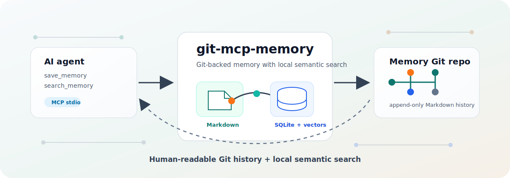
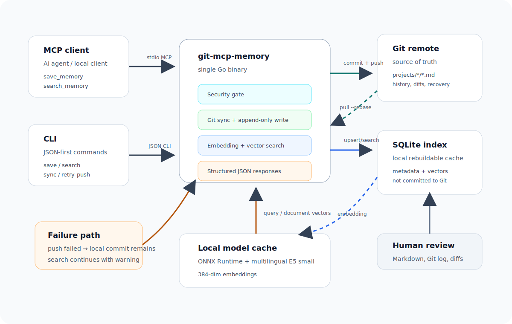

# git-mcp-memory

Git-backed long-term memory for AI agents, served through MCP and a JSON-first CLI.



`git-mcp-memory` stores the source of truth as Markdown files in a Git repository, while using SQLite and local embeddings as a rebuildable search index. It is designed for local AI-agent workflows where memory should be readable by humans, reviewable with Git history, and searchable by meaning.

English | [日本語](#日本語)

## Features

- **Git as the source of truth**: every memory is an append-only Markdown file committed to a normal Git repository.
- **SQLite as a cache**: the local index can be deleted and rebuilt from Markdown.
- **Local vector search**: embeddings run in-process through ONNX Runtime.
- **No Ollama or embedding API server required**: model files are downloaded on first use and cached locally.
- **MCP over stdio**: works as a local MCP server for AI clients.
- **JSON-first CLI**: the same operations are available from the command line.
- **Project-aware search**: memories are grouped by project derived from the workspace path.
- **Cross-project search**: search all stored memories when needed.
- **Safety gate**: common secrets and personal information are rejected before saving.
- **Failure-aware Git behavior**: local commits are preserved when push fails, and `retry-push` can recover later.

## Status

This repository is usable but still young. The current implementation focuses on a local, single-user workflow:

- one main branch in the memory repository
- append-only memory files
- local SQLite index
- local ONNX embedding model
- MCP stdio transport

See [docs/design.md](docs/design.md) for the design notes and tradeoffs.

## Architecture



```text
AI client / CLI
  |
  | save_memory / search_memory
  v
git-mcp-memory
  |
  | Git pull / commit / push
  | Markdown source files
  | SQLite index
  | ONNX embeddings
  v
Memory Git repository
```

Memory repository layout:

```text
memory-repo/
└── projects/
    └── my-project-a1b2c3d4/
        └── decision-title_20260622_101530_a1b2c3.md
```

Each memory file uses Markdown with YAML front matter:

```markdown
---
type: Memory
title: "Decision title"
description: "Short description"
resource: null
tags: []
timestamp: 2026-06-22T10:15:30Z
project_id: "my-project-a1b2c3d4"
source: "mcp"
---

Markdown body...
```

## Requirements

- Go 1.24+
- Git
- Access to a Git remote repository for memory storage
- SSH or HTTPS authentication already configured for that remote
- Network access on first use to download:
  - `intfloat/multilingual-e5-small` from Hugging Face
  - ONNX Runtime from the Microsoft GitHub release

The embedding provider is currently fixed to:

- provider: `builtin_onnx`
- model: `intfloat/multilingual-e5-small`
- dimension: 384

## Installation

From source:

```bash
go build -ldflags '-s -w' -o ~/.local/bin/git-mcp-memory ./cmd/git-mcp-memory
```

Verify:

```bash
git-mcp-memory schema --output json
```

Prebuilt binaries are published from GitHub Releases for:

- Linux amd64
- macOS arm64

Release artifacts include a `.tar.gz` archive and a `.sha256` checksum file.

## Configuration

Create a JSON config file at the default location for your OS.

Default config path:

- macOS: `~/Library/Application Support/git-mcp-memory/config.json`
- Windows: `%LOCALAPPDATA%\git-mcp-memory\config.json`
- Linux: `${XDG_CONFIG_HOME:-~/.config}/git-mcp-memory/config.json`

Example:

```json
{
  "git_dir": "/Users/alice/Library/Application Support/git-mcp-memory/repo",
  "remote_url": "git@github.com:alice/my-memory-repo.git",
  "index_path": "/Users/alice/Library/Application Support/git-mcp-memory/index.sqlite",
  "embedding_provider": "builtin_onnx",
  "embedding_model": "multilingual-e5-small",
  "embedding_model_repo": "intfloat/multilingual-e5-small",
  "embedding_model_revision": "main",
  "embedding_query_prefix": "query: ",
  "embedding_document_prefix": "passage: ",
  "limits": {
    "max_title_bytes": 512,
    "max_content_bytes": 65536,
    "hard_max_content_bytes": 1048576
  },
  "security_policy": {
    "reject_personal_information": true,
    "reject_organization_names": true,
    "reject_customer_names": true
  }
}
```

Notes:

- `remote_url` must point to an existing Git repository.
- Repository creation and SSH key management are intentionally outside this tool.
- If `git_dir` does not exist, the tool clones `remote_url`.
- SQLite is not committed to Git. It is a local cache.

## MCP Usage

Run the MCP server:

```bash
git-mcp-memory mcp
```

Example Codex-style MCP configuration:

```toml
[mcp_servers.gmem]
command = "/Users/alice/.local/bin/git-mcp-memory"
args = ["mcp"]
startup_timeout_sec = 120
```

Available tools:

### `save_memory`

Input:

```json
{
  "current_workspace_path": "/path/to/project",
  "title": "Decision title",
  "content": "Markdown body",
  "dry_run": false
}
```

Behavior:

1. Derives `project_id` from the workspace folder and Git remote/path hash.
2. Rejects unsafe content.
3. Generates a local embedding.
4. Pulls the memory repo with rebase.
5. Writes a new Markdown file.
6. Commits and pushes.
7. Updates the SQLite index after a successful push.

### `search_memory`

Input:

```json
{
  "query": "What did we decide about local embeddings?",
  "current_workspace_path": "/path/to/project",
  "limit": 5,
  "fields": ["title", "path", "content"],
  "snippet_chars": 300
}
```

Use `"all": true` instead of `current_workspace_path` for cross-project search.

### `retry_push`

Retries pushing local commits that were preserved after a push failure.

```json
{
  "dry_run": true
}
```

## CLI Usage

The CLI is designed for AI agents first. JSON output is the default.

Show schema:

```bash
git-mcp-memory schema --output json
```

Check status:

```bash
git-mcp-memory status --output json
```

Save a memory:

```bash
git-mcp-memory save \
  --workspace /path/to/project \
  --title "Decision title" \
  --content "Markdown body" \
  --output json
```

Dry run:

```bash
git-mcp-memory save \
  --workspace /path/to/project \
  --title "Dry run" \
  --content "Validate and embed only." \
  --dry-run \
  --output json
```

Search within the current project:

```bash
git-mcp-memory search "local embeddings" \
  --workspace /path/to/project \
  --limit 5 \
  --output json
```

Search all projects:

```bash
git-mcp-memory search "incident summary" --all --limit 10 --output json
```

Return one JSON object per result:

```bash
git-mcp-memory search "push failure" --all --output ndjson
```

Rebuild/synchronize local state:

```bash
git-mcp-memory sync --output json
```

Retry failed pushes:

```bash
git-mcp-memory retry-push --output json
```

## Agent Skill

This repository includes a Codex-style agent skill for CLI operation:

```text
agents/skills/git-mcp-memory-cli/
```

Use it when an agent needs to call `git-mcp-memory` through the CLI rather than through MCP tools. The skill covers JSON-first command usage, dry-run saves, project and cross-project search, status checks, and push-failure recovery.

## Safety Model

`save_memory` and `save` run a server-side security gate before writing anything.

Always rejected:

- private keys
- AWS access keys
- GitHub tokens
- OpenAI keys
- Slack tokens
- bearer tokens
- env-style secret assignments such as `TOKEN=...`
- invalid UTF-8
- unsafe control characters

Rejected by default, configurable by policy:

- email addresses
- phone numbers
- organization/customer labels detected by the built-in rules

Rejected values are not echoed back in responses. Responses include categories and fields, not the matched secret text.

## Git Failure Behavior

The tool optimizes for preserving memory without hiding synchronization problems.

- Save first creates a local Git commit.
- Push is attempted immediately.
- If push fails, the local commit remains.
- The response contains `pushed: false` and a structured `push_failed` warning.
- Search continues using local repository state when possible and returns a warning.
- `retry-push` can be used after the network or credentials are fixed.

Example warning:

```json
{
  "code": "sync_failed_local_results",
  "message": "retry push failed; search results are based on local repository state",
  "details": {
    "recommended_action": "retry_push",
    "unpushed_commit_count": 1
  }
}
```

## Development

Run tests:

```bash
go test ./...
```

Build:

```bash
go build -o ./bin/git-mcp-memory ./cmd/git-mcp-memory
```

Run a local smoke test:

```bash
git-mcp-memory save \
  --workspace "$PWD" \
  --title "Smoke test" \
  --content "This is a local smoke test." \
  --dry-run \
  --output json
```

## Release

CI runs on pushes and pull requests to `main`.

Releases are created by pushing a `v*` tag:

```bash
git tag v0.1.0
git push origin v0.1.0
```

The release workflow builds native artifacts on GitHub-hosted Linux and macOS runners, uploads checksums, and publishes a GitHub Release.

## 日本語

English は [こちら](#git-mcp-memory)。

### git-mcp-memory


AI agent の長期記憶を Git 管理された Markdown として保存し、MCP と JSON-first な CLI から読み書きするためのローカルツールです。

`git-mcp-memory` は、記憶の正本を Git リポジトリ内の Markdown に置き、SQLite とローカル embedding を再生成可能な検索インデックスとして使います。人間が読めること、Git の履歴で追えること、意味検索できることを同時に満たす設計です。

## 特徴

- **正本は Git**: 記憶は append-only な Markdown ファイルとして commit されます。
- **SQLite は cache**: 壊れたり削除したりしても Markdown から再構築できます。
- **ローカル vector search**: ONNX Runtime でプロセス内推論します。
- **Ollama や外部 embedding API server は不要**: 初回利用時にモデルをダウンロードして cache します。
- **MCP stdio 対応**: ローカル MCP server として AI client から使えます。
- **CLI も同じ機能を提供**: AI agent が叩きやすい JSON 出力を標準にしています。
- **project 単位の検索**: workspace path から `project_id` を導出します。
- **全 project 横断検索**: 必要に応じて全記憶を検索できます。
- **保存前 safety gate**: secret や個人情報を保存前に拒否します。
- **push 失敗に強い**: push に失敗しても local commit を残し、後から `retry-push` で復旧できます。

## 現在の位置づけ

この repository は利用可能ですが、まだ若い実装です。現在はローカル単一ユーザー利用を主対象にしています。

- memory repository は `main` branch を直線的に使う
- 記憶ファイルは append-only
- SQLite は local index
- embedding は local ONNX model
- MCP transport は stdio

詳細な設計メモは [docs/design.md](docs/design.md) を参照してください。

## 構成


```text
AI client / CLI
  |
  | save_memory / search_memory
  v
git-mcp-memory
  |
  | Git pull / commit / push
  | Markdown source files
  | SQLite index
  | ONNX embeddings
  v
Memory Git repository
```

memory repository の例:

```text
memory-repo/
└── projects/
    └── my-project-a1b2c3d4/
        └── decision-title_20260622_101530_a1b2c3.md
```

各 memory file は YAML front matter 付き Markdown です。

## 必要なもの

- Go 1.24+
- Git
- memory 保存用の Git remote repository
- その remote へ push できる SSH または HTTPS 認証
- 初回利用時の model download 用 network access

現在の embedding model:

- provider: `builtin_onnx`
- model: `intfloat/multilingual-e5-small`
- dimension: 384

## インストール

source から build:

```bash
go build -ldflags '-s -w' -o ~/.local/bin/git-mcp-memory ./cmd/git-mcp-memory
```

確認:

```bash
git-mcp-memory schema --output json
```

GitHub Releases では以下の build 済み binary を公開します。

- Linux amd64
- macOS arm64

release artifact には `.tar.gz` archive と `.sha256` checksum を含めます。

## 設定

OS ごとの標準 config path:

- macOS: `~/Library/Application Support/git-mcp-memory/config.json`
- Windows: `%LOCALAPPDATA%\git-mcp-memory\config.json`
- Linux: `${XDG_CONFIG_HOME:-~/.config}/git-mcp-memory/config.json`

設定例:

```json
{
  "git_dir": "/Users/alice/Library/Application Support/git-mcp-memory/repo",
  "remote_url": "git@github.com:alice/my-memory-repo.git",
  "index_path": "/Users/alice/Library/Application Support/git-mcp-memory/index.sqlite",
  "embedding_provider": "builtin_onnx",
  "embedding_model": "multilingual-e5-small",
  "embedding_model_repo": "intfloat/multilingual-e5-small",
  "embedding_model_revision": "main",
  "embedding_query_prefix": "query: ",
  "embedding_document_prefix": "passage: ",
  "limits": {
    "max_title_bytes": 512,
    "max_content_bytes": 65536,
    "hard_max_content_bytes": 1048576
  },
  "security_policy": {
    "reject_personal_information": true,
    "reject_organization_names": true,
    "reject_customer_names": true
  }
}
```

補足:

- `remote_url` は作成済みの Git repository を指定してください。
- GitHub repository 作成や SSH key 作成はこの tool では行いません。
- `git_dir` が存在しなければ `remote_url` から clone します。
- SQLite は Git に commit しません。local cache として扱います。

## MCP として使う

MCP server 起動:

```bash
git-mcp-memory mcp
```

MCP client 設定例:

```toml
[mcp_servers.gmem]
command = "/Users/alice/.local/bin/git-mcp-memory"
args = ["mcp"]
startup_timeout_sec = 120
```

利用できる tool:

- `save_memory`
- `search_memory`
- `retry_push`

`save_memory` は保存前に安全性検査、embedding 生成、Git pull、Markdown 作成、commit、push、index 更新を行います。

`search_memory` は Git の同期、SQLite 再 index、query embedding 生成、vector search を行います。

`retry_push` は push 失敗時に残った local commit の再送に使います。

## CLI として使う

schema:

```bash
git-mcp-memory schema --output json
```

status:

```bash
git-mcp-memory status --output json
```

保存:

```bash
git-mcp-memory save \
  --workspace /path/to/project \
  --title "Decision title" \
  --content "Markdown body" \
  --output json
```

dry-run:

```bash
git-mcp-memory save \
  --workspace /path/to/project \
  --title "Dry run" \
  --content "Validate and embed only." \
  --dry-run \
  --output json
```

project 検索:

```bash
git-mcp-memory search "local embeddings" \
  --workspace /path/to/project \
  --limit 5 \
  --output json
```

全 project 横断検索:

```bash
git-mcp-memory search "incident summary" --all --limit 10 --output json
```

同期と再 index:

```bash
git-mcp-memory sync --output json
```

push 再試行:

```bash
git-mcp-memory retry-push --output json
```

## Agent Skill

この repository には CLI 操作用の Codex-style agent skill を同梱しています。

```text
agents/skills/git-mcp-memory-cli/
```

MCP tool ではなく CLI から `git-mcp-memory` を使う agent 向けです。JSON-first な command 利用、dry-run 保存、project 検索、全 project 横断検索、status 確認、push 失敗時の復旧手順を含みます。

## セキュリティ

`save_memory` と `save` は保存前に server-side の safety gate を通します。

常に拒否されるもの:

- private key
- AWS access key
- GitHub token
- OpenAI key
- Slack token
- bearer token
- `TOKEN=...` のような env secret
- invalid UTF-8
- 危険な control character

デフォルトで拒否されるもの:

- email address
- phone number
- built-in rule で検出される会社名、顧客名 label

拒否された値そのものは response に含めません。category と field だけを返します。

## Git 障害時の挙動

この tool は、同期失敗を隠さず、かつ local の記憶を失わないことを重視します。

- 保存時は local Git commit を作成します。
- push は即座に試みます。
- push に失敗しても local commit は残します。
- response には `pushed: false` と `push_failed` warning を返します。
- search は可能な限り local repository state で継続し、warning を返します。
- network や認証を直した後に `retry-push` で復旧できます。

## 開発

test:

```bash
go test ./...
```

build:

```bash
go build -o ./bin/git-mcp-memory ./cmd/git-mcp-memory
```

smoke test:

```bash
git-mcp-memory save \
  --workspace "$PWD" \
  --title "Smoke test" \
  --content "This is a local smoke test." \
  --dry-run \
  --output json
```

## Release

CI は `main` への push と pull request で実行されます。

release は `v*` tag を push すると作成されます。

```bash
git tag v0.1.0
git push origin v0.1.0
```

release workflow は GitHub-hosted Linux/macOS runner で native artifact を build し、checksum と一緒に GitHub Release へ公開します。
